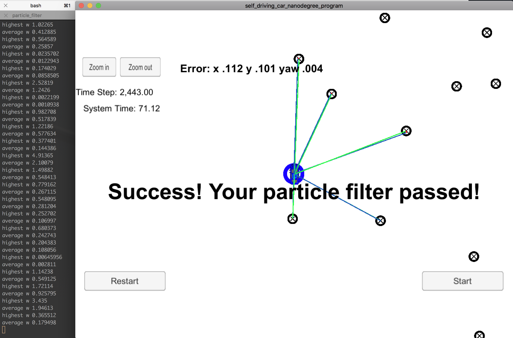

# Term2 - Project 3 : Kidnapped Vehicle (Particle Filter) project

Self-Driving Car Engineer Nanodegree Program

Project 3 - Particle Filter

# Project Rubric

### Compiling

After cloning this repo.

```
1. mkdir build
2. cd build
3. cmake ..
4. make
5. ./particle_filter
```

### Success Criteria
If your particle filter passes the current grading code in the simulator (you can make sure you have the current version at any time by doing a `git pull`), then you should pass!

The things the grading code is looking for are:


